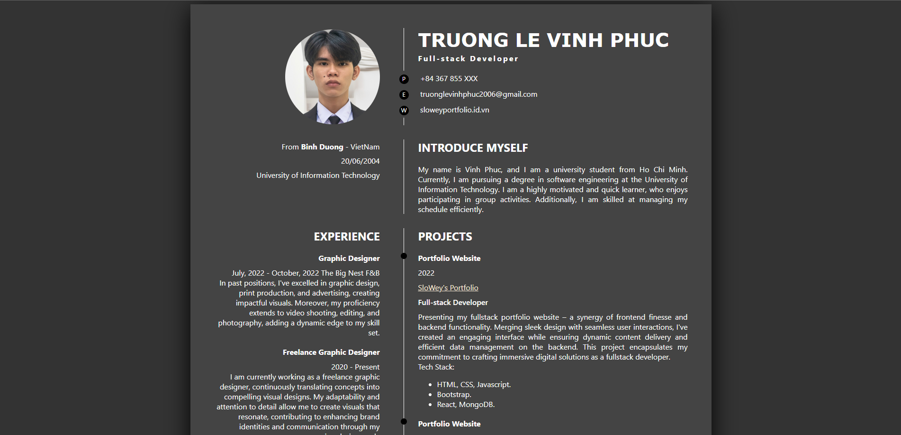

# CVWeb - Personal CV Website

CVWeb is a personal CV (curriculum vitae) website that showcases your skills, experiences, and projects in a visually appealing way. This project provides a responsive and modern design, making it easy for visitors to learn about your qualifications and achievements.

## Table of Contents

- [Demo](#demo)
- [Features](#features)
- [Usage](#usage)
- [Customization](#customization)
- [Contributing](#contributing)
- [License](#license)

## Demo

You can access the live demo of CVWeb at [https://yourusername.github.io/CVWeb](https://yourusername.github.io/CVWeb).

## Features

- Responsive layout for optimal viewing on various devices.
- Organized sections for personal information, experiences, skills, and projects.
- Easy-to-update structure through HTML and CSS files.
- Dark color scheme for an elegant and modern appearance.

## Usage

1. Open the `index.html` file in a web browser to view your personal CV website.
2. Edit the content in the HTML and CSS files according to your information.
3. Customize the colors, fonts, and styles to match your personal brand.

## Customization

CVWeb can be customized to match your personal preferences:

- Update personal information in the `index.html` file.
- Modify the CSS in the `styles.css` file to adjust colors, fonts, and layout.
- Replace the profile image in the `img` directory with your own image.
- Add or remove sections as needed by duplicating or removing HTML elements.

## Contributing

Contributions to CVWeb are welcome! If you find any issues or have suggestions for improvements, feel free to create an issue or submit a pull request.

1. Fork the repository.
2. Create a new branch: `git checkout -b feature/your-feature-name`.
3. Commit your changes: `git commit -m 'Add some feature'`.
4. Push to the branch: `git push origin feature/your-feature-name`.
5. Submit a pull request.

## License

This project is licensed under the [MIT License](./LICENSE).
